# YSOA Tlatelolco - Data Maps Workshop

## Introduction

- Maps were in use long before graphics were invented, but maps and graphics are closely related.

  What does Petrus Apianus 1546 design in _Cosmographia_ remind you of?

  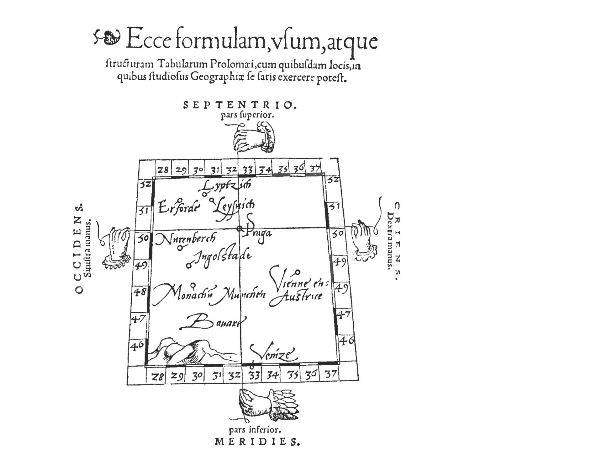

- Dr John Snow plotted the locations of deaths from cholera in central London for September 1854.

  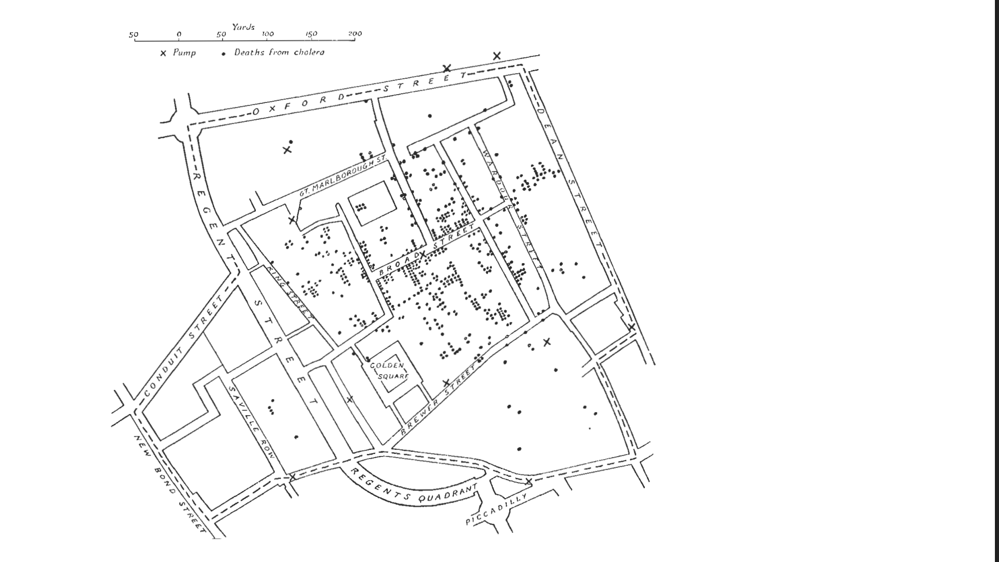

- Jacques Bertin's 1967 _Semiologie graphique_ provides the first theoretical foundation for information visualization (visual variables) and sets the foundation for modern cartography.

  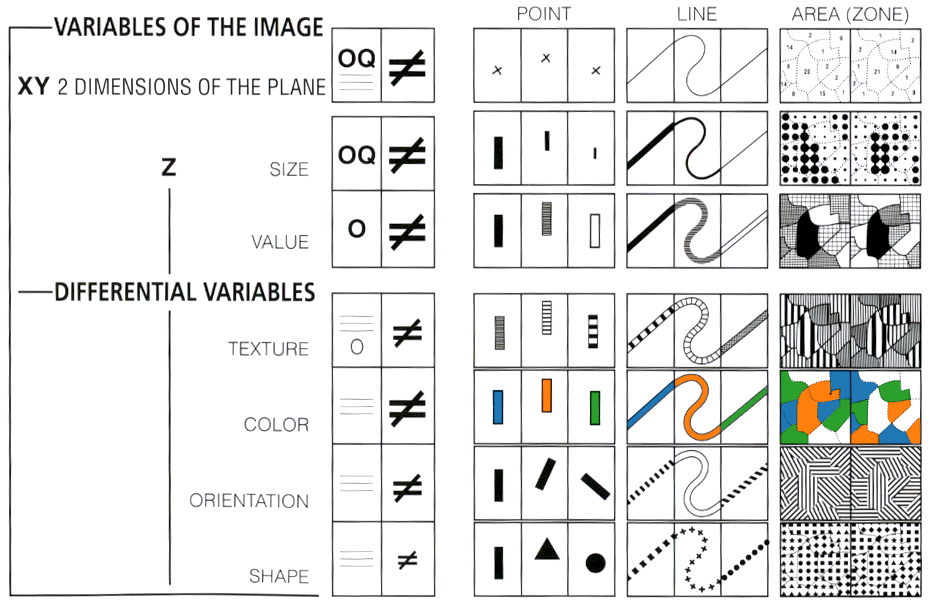

- "It may well be the best statistical graphic ever drawn". Charles Joseph Minard's 1869 _Carte figurative..._.

  

- Choropleths condense an incredible amount of information in space. They are also what the type of maps that I started using during my PhD.
  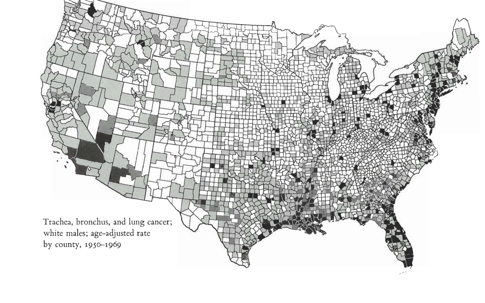

## Definitions

**Geographical information systems (GIS)**

> Software which can _capture_, _store_, _manipulate_, _analyse_ and _visualize_ **spatial data**.

**Spatial data**

> Data that has some information that links it directly or indirectly to a location.

**Coordinate reference systems (CRS)**

> A mechanism to map locations in the real world to coordinate pairs. Typically, this involves a choice in terms of what ellipsoid models the Earth, a horizontal datum and most famously a projection.

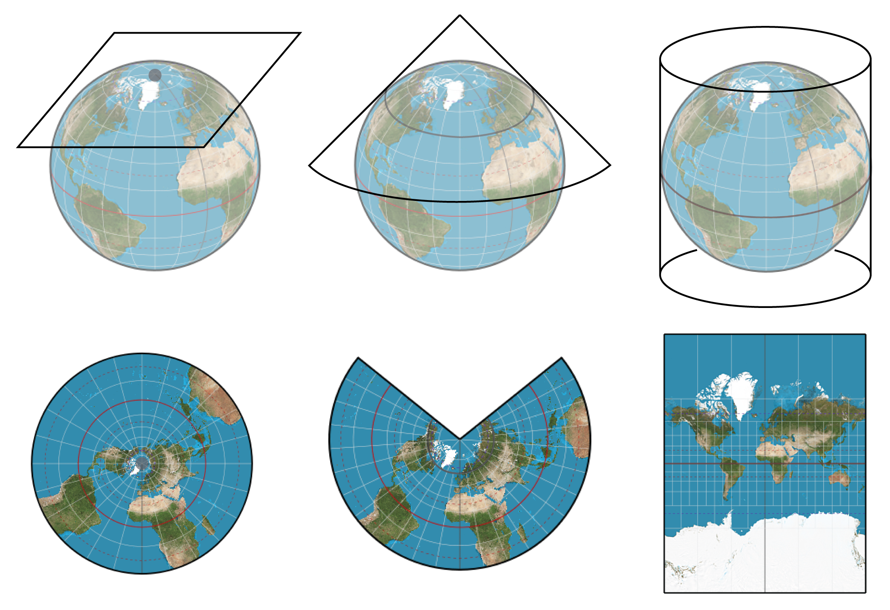

Projections can be a pretty technical subject and we will not cover them in detail. When in doubt, try to confirm that you are using WGS84, Mercator or something that is close to something "standard".

### Raster data

A geo-referenced image where _pixel_ values carry a meaning at each location (useful for elevation, land cover, weather).

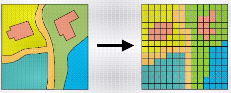 

Data formats include GeoTIFF, JPEG.

### Vector data

The spatial equivalent of SVG, composed of **features** which can be a

- Point (0D): one pair of coordinates (POIs, a tree, a power plant).
- Line (1D): each vertex has a coordinate, join together to create a linear feature with length (rivers, roads, fences).
- Polygon (2D): each vertex has a coordinate, join together to create an enclosed feature with an area.

Data formats include Shapefile (.shp, .shx, .dbf, .prj) and GeoJSON.

## Workshop: Tracing the water in Mexico City

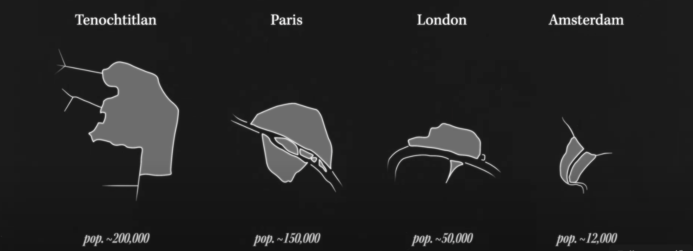

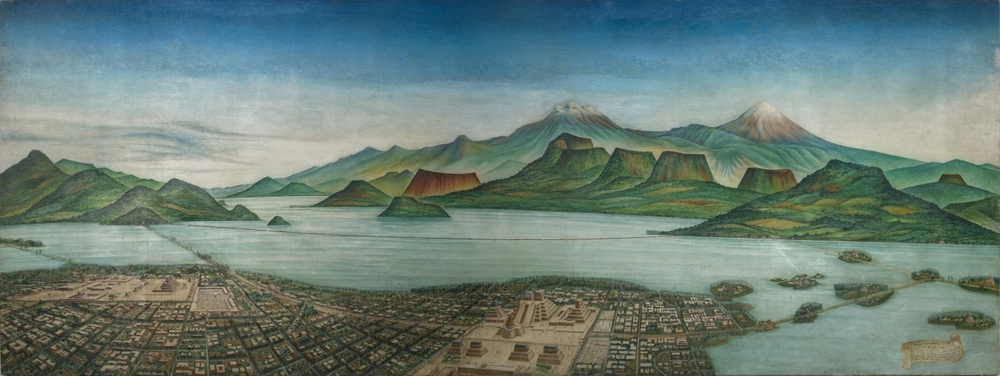

### Step 1: Capture your spatial data with [Placemark](https://play.placemark.io/)

A spatial data editor which unfortunately was not commercially viable and was released as Open Source (and free!) by [Tom MacWright](https://macwright.com/).

- Drag and drop, or click Import to upload your data.

  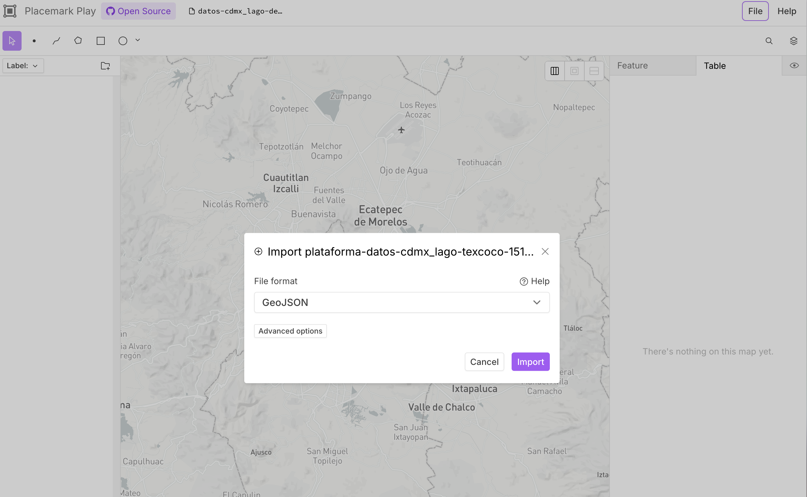

**Troubleshooting**: To import shapefiles, place them in a folder and import the entire folder. Note that only the most common shapefile components (.shp, .shx, .dbf, .prj) are supported.

- You can select the features and edit their attributes. You can edit their vertices.

- You can use Geometry operations or click Buffer.

- Export your Folders. GeoJSON is the easiest format to work with. It will also be easier later on if you separate your features by type. If you don't do this you will need to use the `filter` option on Mapbox and add a _filtered_ layer for each type.

**Warning**: The _undo_ functionality is partially broken. Be wary of doing operations that are destructive, and we recommend that you export your work regularly.

#### (Optional) Styling

Placemark supports custom styling using the `fill` and `stroke` attributes to which you pass colours using hex codes (eg. `#58A4E8`) but best practice is to separate data from presentation styling, and we will normally style the map only on Mapbox, not on Placemark.

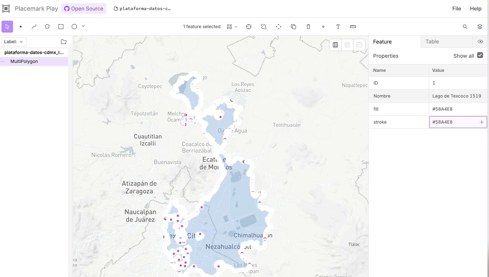

### Step 2: Create your map and style your data using [Mapbox Studio](https://www.mapbox.com/)

It's free to register to Mapbox but you will still need some card details.

#### Add your (custom) data

First, add your custom data by creating a new Tileset (under the "Data manager menu"). Your life will be easier if you add different types of features (i.e. points, lines and polygons) as different Tilesets. That way you can easily select the right style for each layer.

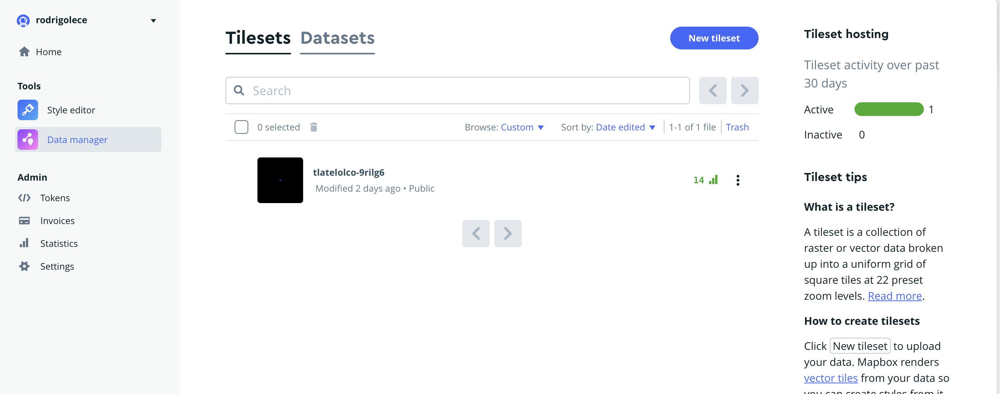

Make sure that you make your Tileset public. Click on the Share menu and toggle the visibility to public.

**Troubleshooting**: If you publish your map and only see the base layer without your data, then it's likely that the Tileset you are using is set to Private. Change the visibility to fix it.

#### Create the map as a Style

The actual map is created as a Style (Mapbox' base layer). Create a new style. You can try to add a simple style OR try to use the dropdown menu to create a new style from a "Classic template".

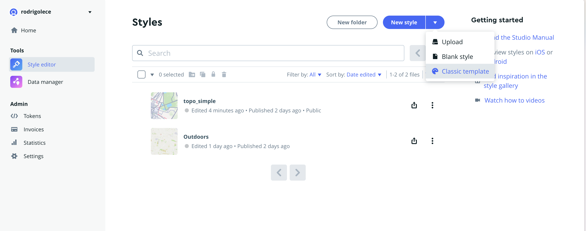

Play around with the menus and customise the style of your map.

Add your data using the + symbol on the Layers menu, and select your new Tilesets as the Source under the Select data pane (select the right type -circle, fill, etc.- for the right type of feature). Note that if you are working with a GeoJSON that has different types of features you will need to set a filter.

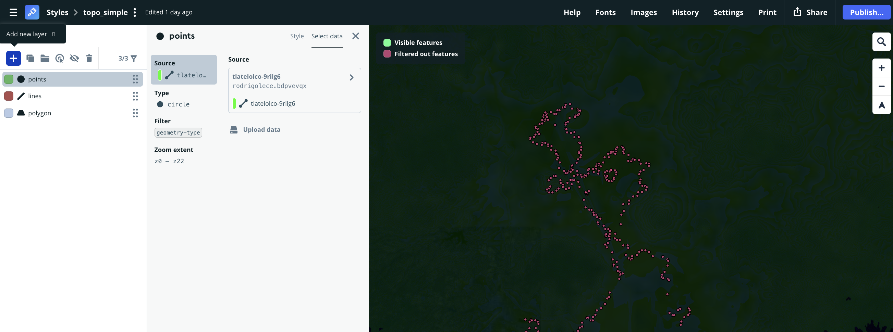

### Step 3: Get your map out into the real world

When you are ready to share your map with the whole world, click on the Share button.

The easiest way to take your map with you elsewhere is to embed in a website. You can create your own website, for example with [cargo.site](cargo.site), and you add the `<iframe ...>` string (see the screenshot below) to the source file of your website.

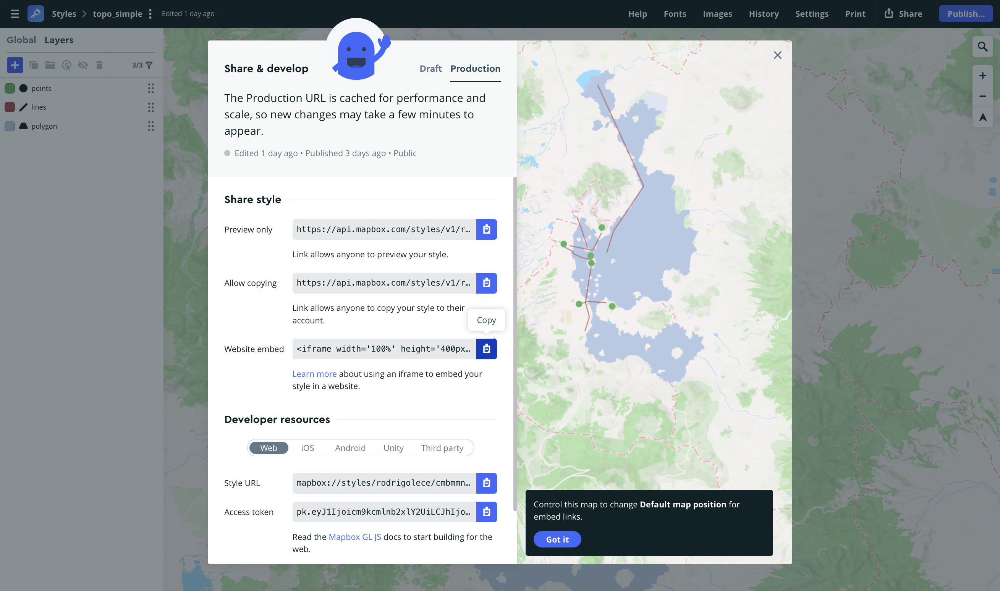

**NB**: Clicking on Publish updates the Production version of your map, use the Draft for faster iterations until you are happy with the result.

## Now it's your turn!

Download data for Tlatelolco using [this Dropbox link](https://www.dropbox.com/scl/fi/gx0o30a5mv62ieew6qxm1/ysoa_tlatelolco_datasets.zip?rlkey=n9nsg64rt20faqa7soc6jppwh&st=bndf29ms&dl=0).
