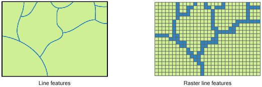
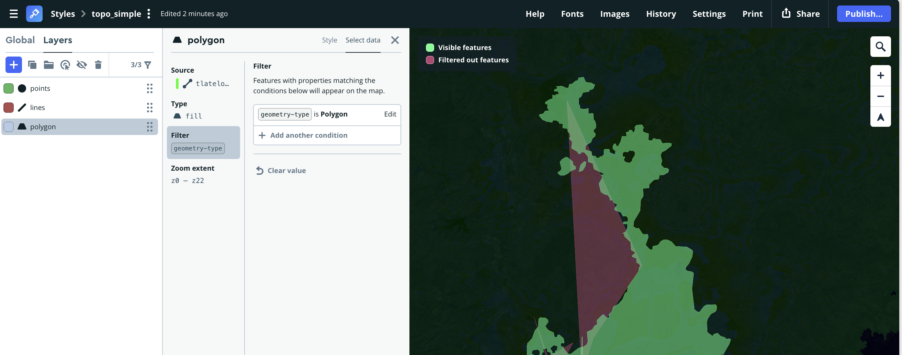

# YSOA Tlatelolco - Data Maps Workshop

## Introduction

- Maps were in use long before graphics were invented, but maps and graphics are closely related.

  What does Petrus Apianus 1546 design in _Cosmographia_ remind you of?

  

- Dr John Snow plotted the locations of deaths from cholera in central London for September 1854.

  

- Jacques Bertin's 1967 _Semiologie graphique_ provides the first theoretical foundation for information visualization (visual variables) and sets the foundation for modern cartography.

  

- "It may well be the best statistical graphic ever drawn". Charles Joseph Minard's 1869 _Carte figurative..._.

  

- Choropleths condense an incredible amount of information in space. They are also what the type of maps that I started using during my PhD.
  

## Definitions

**Geographical information systems (GIS)**

> Software which can _capture_, _store_, _manipulate_, _analyse_ and _visualize_ **spatial data**.

**Spatial data**

> Data that has some information that links it directly or indirectly to a location.

**Coordinate reference systems (CRS)**

> A mechanism to map locations in the real world to coordinate pairs. Typically, this involves a choice in terms of what ellipsoid models the Earth, a horizontal datum and most famously a projection.

Projections can be a pretty technical subject and we will not cover them in detail. When in doubt, try to confirm that you are using WGS84, Mercator or something that is close to something "standard".

### Raster data

A geo-referenced image where _pixel_ values carry a meaning at each location (useful for elevation, land cover, weather).

 

Data formats include GeoTIFF, JPEG.

### Vector data

The spatial equivalent of SVG, composed of **features** which can be a

- Point (0D): one pair of coordinates (POIs, a tree, a power plant).
- Line (1D): each vertex has a coordinate, join together to create a linear feature with length (rivers, roads, fences).
- Polygon (2D): each vertex has a coordinate, join together to create an enclosed feature with an area.

Data formats include Shapefile (.shp, .shx, .dbf, .prj) and GeoJSON.

## Workshop: Tracing the water in Mexico City

### [Placemark](https://play.placemark.io/)

A spatial data editor which unfortunately was not commercially viable and was realeased as Open Source (and free!) by [Tom MacWright](https://macwright.com/).

- Drag and drop, or click Import to upload your data.

  

**Troubleshooting**: To import shapefiles, place them in a folder and import the entire folder. Note that only the most common shapefile components (.shp, .shx, .dbf, .prj) are supported.

- You can select the features and edit their attributes. You can edit their vertices.

- You can use Geometry operations or click Buffer.

- Export your Folders. GeoJSON is the easiest format to work with. It will also be easier later on if you separate your features by type.

**Warning**: The _undo_ functionality is partially broken. Be wary of doing operations that are destructive, and we recommend that you export your work regularly.

#### Styling

Placemark supports custom styling using the `fill` and `stroke` attributes to which you pass colours using hex codes (eg. `#58A4E8`).

Note that it's generally not considered best practice to mix data with its presentation styling.

### Mapbox Studio

You will need to register for a (free) Mapbox account.

First, add your custom data by creating a new Tileset (under the "Data manager menu").

The actual map is created as a Style (Mapbox' base layer). Create a new style (try a simple style and also try to use the dropdown menu to create a new style from a "Classic template")

Play around with the menus and customise the style of your map.

When ready, you can add your data using Layers and change their style!

NB: if you have different geometry types in your Tileset then you will need to use a filter like so:

## Now it's your turn!

Download data for Tlatelolco using [this Dropbox link](https://www.dropbox.com/scl/fi/gx0o30a5mv62ieew6qxm1/ysoa_tlatelolco_datasets.zip?rlkey=n9nsg64rt20faqa7soc6jppwh&st=bndf29ms&dl=0).
